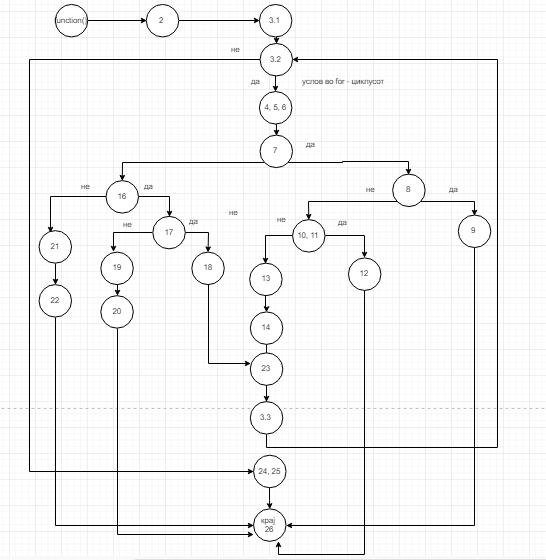

Христијан Даиловски, бр. на индекс 185014.

-Група на код: 
 
    6  
-Слика од нацртаниот CFG (со некоја алатка за цртање дијаграми):
  
-Пресметка за цикломатската комплексност на функцијата и објаснување за дадениот резултат:  
 
    Цикломатска комплексност = (број_на_ребра) - (број_на_јазли) + 2 = 27 - 23 + 2 = 6
   
-утврдените тест случаи според доделените критериуми за тестирање   

    Тест случаи според критериумот Every path:
    
    Path	                                                True/False  Test Case	    Output
    1|2|3.1|3.2|24,25|26	                                F           0	            return result;
    1|2|3.1|3.2|4,5,6|7|16|21|22|26                         TFF         1, -2, 25, 4    The angle is smaller or greater than the minimum
    1|2|3.1|3.2|4,5,6|7|16|17|19|20|26                      TFTF        1, 360, 25, 3   The angle is greater than  the maximum
    1|2|3.1|3.2|4,5,6|7|16|17|18|23|3.3|3.2|24,25|26        TFTTF       1, 360, 0,  0   return result;
    1|2|3.1|3.2|4,5,6|7|8|10,11|13|14|23|3.3|3.2|24,25|26	TTFFF       1, 7, 35, 21    return result;
    1|2|3.1|3.2|4,5,6|7|8|10,11|12|26                   	TTFT        1, 11, 42,-10   The seconds of the angle are not valid
    1|2|3.1|3.2|4,5,6|7|8|9|26                          	TTT         1, 98, -30, 12  The minutes of the angle are not valid!
    
    Јазлите се: 3.2 7 8 16 17 10,11 се услови во кодот			
    Test case format:  angleList.size()[, deg, min, sec] 			
    []-се што е во заградиве е опционално			
    Пример ако angleList.size() ==0 тогаш опционалните параметри не постојат
    
    
    
    Тест случаи според критериум Multiple condition:
    
      						
    Test case format:  angleList.size()[, deg, min, sec] 				
    []-се што е во заградиве е опционално					
    Пример ако angleList.size() ==0 тогаш опционалните параметри не постојат	
    
    if(deg>=0 && deg<360)					
    
    combination	Posible Test Case   Branch				
    TT	        1, 55, 20, 15	    7 --8				
    TF	        1, 370, 25, 45	    7 --16				
    FX	        1, -56, 89, 98	    7 --16				

    if(min<0 || min >59)						
    
    combination	Posible Test Case   Branch				
    TX	        1,52, -3, 5 	    8 -- 9				
    FT	        1, 89, 12, 16	    8 -- 9				
    FF	        1, 46,36,12         8 -- 10,11				
    
    if(sec<0 || sec >59)						
    
    combination	Posible Test Case   Branch				
    TX	        1, 56, 32, -6	    10,11 -- 12				
    FT	        1, 212, 41,65	    10,11--12				
    FF	        1, 310, 20, 35	    10,11 --13				
    
    if(min ==0 &&  sec ==0)						
    
    combination	Posible Test Case   Branch				
    TT	        1, 360, 0,0         17 -- 18				
    TF	        1, 360, 0 ,-18	    17 -- 19				
    FX	        1, 360, -45, -89    17 -- 19

-објаснување како ги напишавте unit тестовите за секој од критериумите:

    За секој од горе наведените критериуми (every path и multiple condition) 
    имам направено две функции. Во секоја од функциите ги имам тестирано тест
    случаевите кои се дадени предходно за двата критериуми. Тестирањето го правам
    со помош на assertThrows() и assertNotNull(), за проверување дали се случил
    исклучок (RuntimeException) или функцијата завршила успешно. Сите тестови се 
    успешни.
